# Advanced Usage Guide: Kotlin External FIR Support (KEFS)

This is KEFS in action:

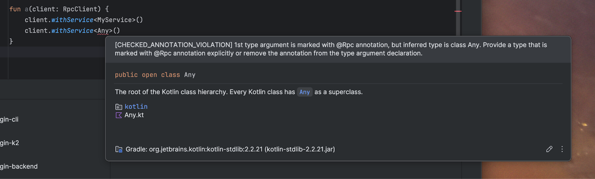

This diagnostic is provided by an external compiler plugin.
It works stably in IDE thanks to KEFS.

This guide provides a deep dive into all the user-facing settings, diagnostics, and workflows for the KEFS plugin.

> Some UI pictures may be outdated in details, core functionality remains.

## 0. Problem statement

Kotlin compiler API is not stable and can change at any time.
This means that compiler plugins that rely on the compiler API may break in between releases.
It is relatively easy to address this problem for project builds
by publishing a new version of the plugin for each stable release of the Kotlin compiler.

It is far more complicated when it comes to running the plugin in the IDE.

IDE **does not** run non-bundled plugins by default.
It is because the IDE has its own Kotlin compiler that runs inside it
and provides highlighting information, diagnostics, generated code rendering, etc.

This compiler version is different from the one in a user's project.
This means that the IDE's compiler may not be compatible with the plugin's API with the high probability.

Incompatibility can lead to crashes, incorrect behavior, or unexpected results in the IDE.

## 0.1. Solution: KEFS

KEFS is a plugin that knows how to tell Kotlin in the IDE
that it should use a different version of a compiler plugin from the user project.

It can cache, store, analyse, and manage all plugin jars.
It can also monitor the IDE for any exceptions thrown by the plugin.

> All of this, provided that there is a compatible version of the plugin (see [Developer guide](PLUGIN_AUTHORS.md))

## 1. Configuring Plugins (Settings)

All configuration is managed under <kbd>Tools</kbd> > <kbd>Kotlin External FIR Support</kbd>.

### General Settings

This tab controls the plugin's high-level behavior, primarily related to stability and exception
handling.

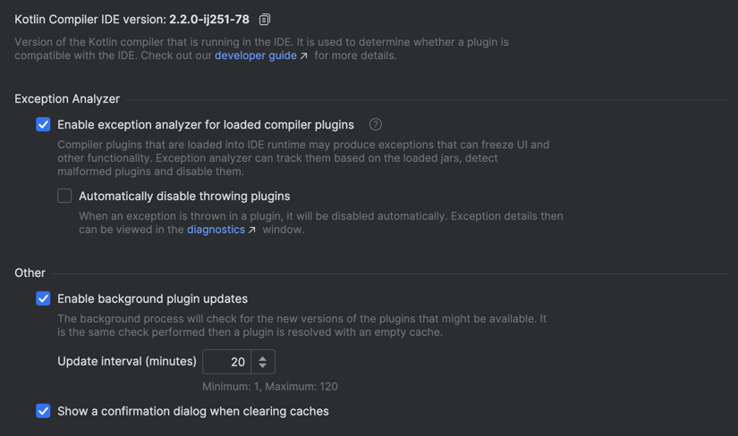

* **Kotlin Compiler IDE version:** Displays the current Kotlin version used by your IDE. This is
  the version your plugins *must* be compatible with.
* **Enable Kotlin plugin exception analyzer:** This is the plugin's core stability
  feature. When enabled, KEFS monitors the IDE for any exceptions thrown by a compiler
  plugin.
* **Automatically disable throwing plugins:** If the analyzer is enabled, this setting tells KEFS to
  automatically disable any plugin that throws an exception. You will be notified by a
  balloon pop-up.
* **Enable background plugin updates:** This setting tells KEFS to automatically check for plugin updates with a specified period.
* **Show confirmation dialog when clearing caches:** Toggles the confirmation pop-up for the "Clear Caches"
  action.

### Artifacts Settings

This is the main configuration panel where you define your repositories and link them to your compiler
plugins.

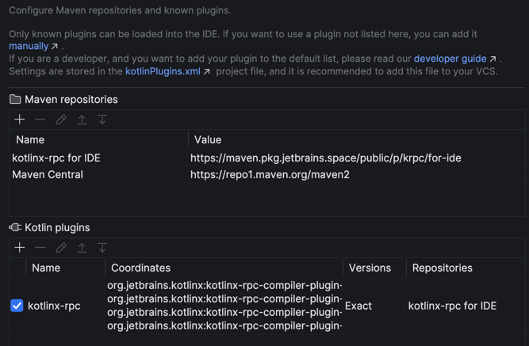

> Each change to these settings will reload the KEFS state.
> This is an inexpensive operation when all plugins are already loaded, but the IDE will need to
> lazily re-request all plugins.

**Maven Repositories**
This section lists all repositories KEFS will search for compatible plugin jars.

* **Adding Repositories:** You can add two types of repositories:
    * **Remote (URL):** A standard remote repository like Maven Central or a private one.
    * **Local (File path):** A local directory on your file system that is structured as a Maven
      repository (e.g., your `build/repo` or `~/.m2/repository`). This is essential for local plugin
      development.
* **Editing Repositories:** You can edit any repository you've added. Default
  repositories (which are bundled with KEFS) cannot be edited.

Adding a new repository:


Editing the default repository:

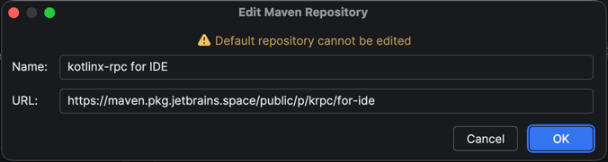

**Kotlin Compiler Plugins**
This section defines the "bundles" for each compiler plugin. A bundle can consist of one or more artifacts
that work together.

* **Adding/Editing Plugins:** When you add or edit a plugin, you configure the following:
    * **Name:** A unique, human-readable name for the bundle (e.g., `kotlinx-rpc`).
    * **Coordinates:** The Maven coordinates (`groupId:artifactId`) for *each* artifact in the bundle, one
      per line. **Do not include the version.**
    * **Version matching:** This strategy tells KEFS how to find a compatible version: *Exact*, *Same Major*,
      or *Latest*. See [Version Matching](#version-matching) for more details.
    * **Repositories:** A list of repositories from the defined
      above. KEFS will only search for this plugin in the selected repositories.
    * **Enable this plugin in the project:** A master on/off switch for this plugin bundle.
    * **Ignore plugin exceptions:** Disables the exception analyzer *only* for this specific
      plugin.
    * **Replacement patterns** (Advanced): Modify how KEFS detects and searches for plugins. 
      See [Replacement Patterns](#6-advanced-use-case-replacement-patterns)

Adding a new plugin:

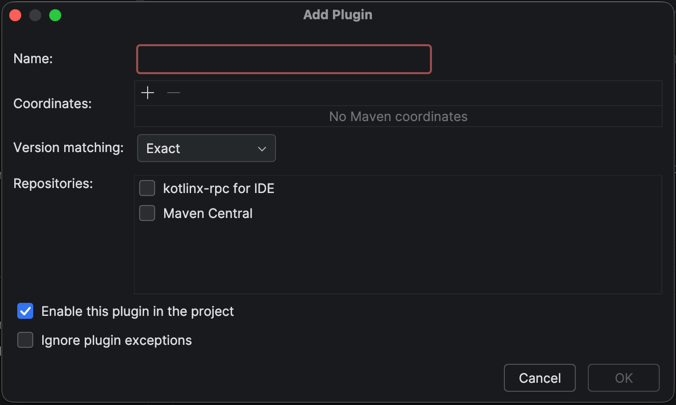

Editing the default plugin:

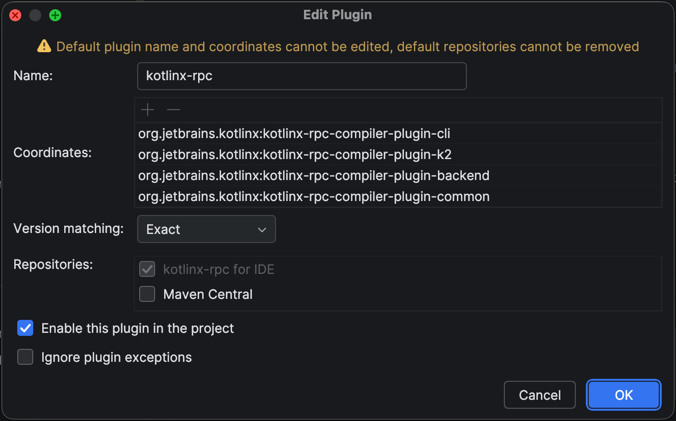

#### Storing Settings

When done and saved the settings, `.idea/kotlin-plugins.xml` will be created in your project.
Add it to your VCS so that other developers can use the same workflow.

#### Version Matching

It is important to understand the version matching strategies.
Each plugin artifact must follow the same version pattern that KEFS understands:

```
<groupId>:<artifactId>:<kotlinVersion>-<libraryVersion>
```

Here only `kotlinVersion` and `libraryVersion` are relevant.

`kotlinVersion` is the Kotlin version used to compile the plugin.
KEFS will replace the project's Kotlin version with the Kotlin version from the IDE.

`libraryVersion` is the version of the plugin itself.
It can be replaced using one of the following strategies:

* **Exact** – The replaced `libraryVersion` must be identical to the one in the project.
* **Same Major** – The replaced `libraryVersion` will share the same major version as the one requested (or the same minor for 0.x
  versions).
* **Latest** – The replaced `libraryVersion` will be the latest available version.

Loaded versions will be at least the same as the requested one.
The highest matching version is always used.

Examples:

```
# Artifact used in the project
org.jetbrains.kotlinx:kotlinx-rpc-compiler-plugin-k2:2.2.20-0.10.0

# Artifact that KEFS will try to find in a repository with 'Exact' version matching
org.jetbrains.kotlinx:kotlinx-rpc-compiler-plugin-k2:2.2.0-ij251-78-0.10.0 

# Same Major. Given these artifacts available:
org.jetbrains.kotlinx:kotlinx-rpc-compiler-plugin-k2:2.2.0-ij251-78-0.10.0
org.jetbrains.kotlinx:kotlinx-rpc-compiler-plugin-k2:2.2.0-ij251-78-0.10.1
org.jetbrains.kotlinx:kotlinx-rpc-compiler-plugin-k2:2.2.0-ij251-78-0.10.2 # this one will be choosen

# Same Major. Given these artifacts available:
org.jetbrains.kotlinx:kotlinx-rpc-compiler-plugin-k2:2.2.0-ij251-78-1.10.0
org.jetbrains.kotlinx:kotlinx-rpc-compiler-plugin-k2:2.2.0-ij251-78-1.12.1
org.jetbrains.kotlinx:kotlinx-rpc-compiler-plugin-k2:2.2.0-ij251-78-1.20.2 # this one will be choosen

# Latest. Given these artifacts available:
org.jetbrains.kotlinx:kotlinx-rpc-compiler-plugin-k2:2.2.0-ij251-78-0.10.0
org.jetbrains.kotlinx:kotlinx-rpc-compiler-plugin-k2:2.2.0-ij251-78-0.10.1
org.jetbrains.kotlinx:kotlinx-rpc-compiler-plugin-k2:2.2.0-ij251-78-1.1.0 # this one will be choosen
```

Note: When more than one artifact is present in a plugin bundle, KEFS will try to find the
highest version that matches the criteria across all artifacts. 
If one artifact doesn't have this version – the bundle will be considered as not found.

```
# Artifact used in the project, bundle of two
org.jetbrains.kotlinx:kotlinx-rpc-compiler-plugin-k2:2.2.20-0.10.0
org.jetbrains.kotlinx:kotlinx-rpc-compiler-plugin-common:2.2.20-0.10.0

# Given available artifacts like this and 'Latest' criteria:
org.jetbrains.kotlinx:kotlinx-rpc-compiler-plugin-k2:2.2.0-ij251-78-0.11.0
org.jetbrains.kotlinx:kotlinx-rpc-compiler-plugin-common:2.2.0-ij251-78-0.11.0
org.jetbrains.kotlinx:kotlinx-rpc-compiler-plugin-k2:2.2.0-ij251-78-0.12.0 # this one will be choosen
org.jetbrains.kotlinx:kotlinx-rpc-compiler-plugin-common:2.2.0-ij251-78-0.12.0 # this one will be choosen

# But here none will be choosen 
org.jetbrains.kotlinx:kotlinx-rpc-compiler-plugin-k2:2.2.0-ij251-78-0.11.0
org.jetbrains.kotlinx:kotlinx-rpc-compiler-plugin-common:2.2.0-ij251-78-0.11.0
org.jetbrains.kotlinx:kotlinx-rpc-compiler-plugin-k2:2.2.0-ij251-78-0.12.0
```

See more versions how-to's in the [Developer guide](PLUGIN_AUTHORS.md).

---

## 2. Diagnosing Plugin State (Tool Window)

The <kbd>KEFS Diagnostics</kbd> tool window is your primary view into what KEFS is doing. It shows the
real-time status of all configured plugin bundles and their artifacts.

The UI is split into a tree view of plugins on the left and a details panel on the right.

### Plugin Statuses

* **Successfully Loaded:** The plugin, all its artifact versions were found and
  loaded successfully. The details pane will show information about the loaded jar and a link to its cache
  location.
  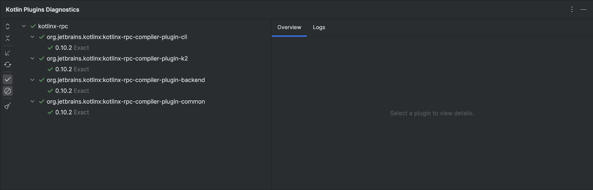
    * You can also see a list of all classes that KEFS analyzed from the jar, which are used for exception
      matching.
      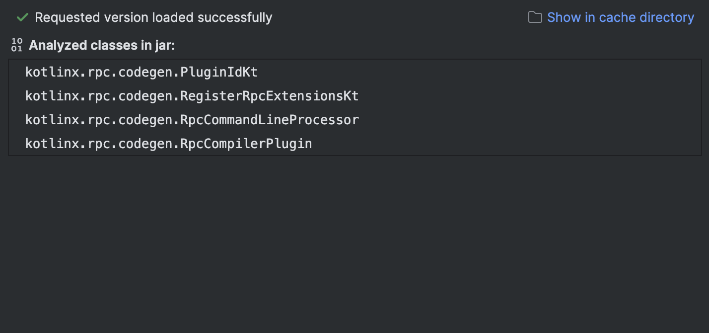
* **Plugin is Not Requested:** The plugin is configured in settings but has not yet been requested by the
  IDE. Resolution is lazy and happens on demand.
  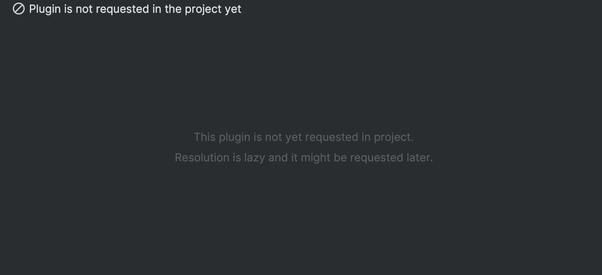
* **Artifact is Disabled:** The plugin is disabled in the settings. You can enable it
  directly from the "details" pane.
  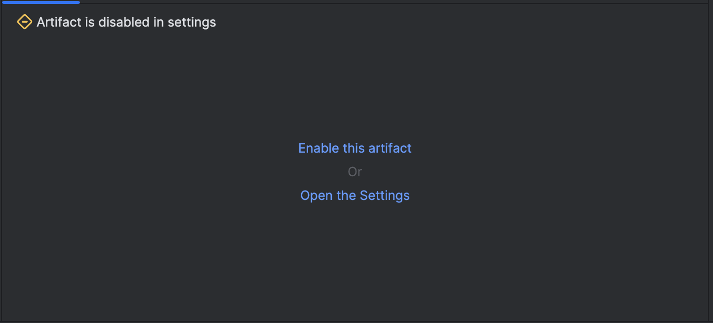
* **Partial Resolve:** This means some artifacts in a bundle were found, but others
  were not. The entire plugin will be skipped until all parts are loaded successfully.
  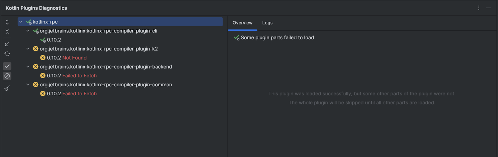
* **Failed to Fetch:** An error occurred during resolution (e.g. a network error, a file-already-exists
  exception). The details pane will show the error log.
  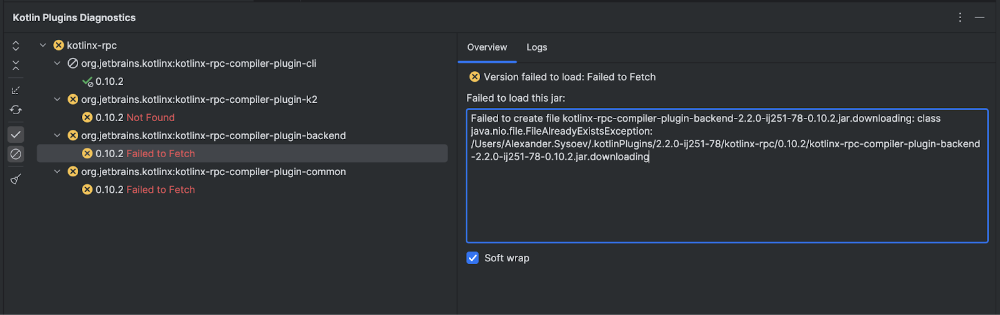
* **Not Found:** The plugin or artifact was not found in any of the specified repositories with a
  compatible version. The details pane will show the resolution log.
  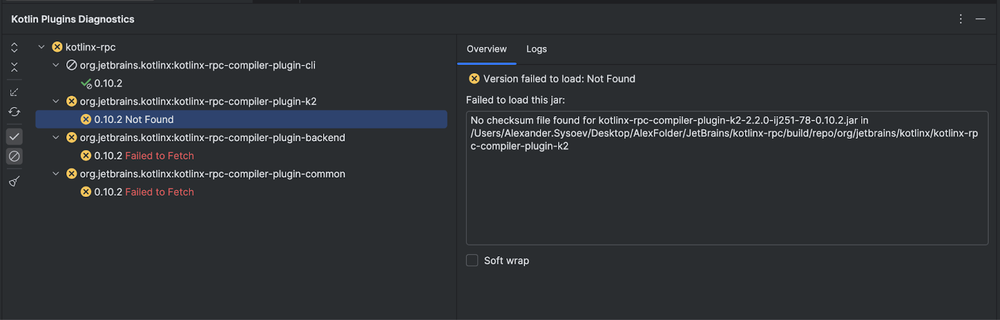
* ** Exception in Runtime:** The plugin threw an exception during runtime. See the
  [Handling Runtime Exceptions](#3-handling-runtime-exceptions) section for more details.
  

---

## 3. Handling Runtime Exceptions

This is a key workflow for ensuring IDE stability. When the Exception Analyzer is enabled and a plugin
throws an error during runtime, KEFS will catch it.

* **Banner Notification:** A banner will appear at the top of your editor, identifying the plugin that
  failed.
  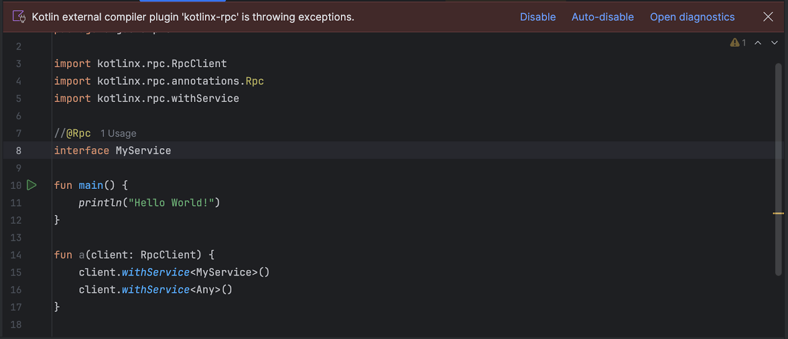
    * **Disable:** Immediately disables the failing plugin, which should restore your IDE's highlighting and analysis.
    * **Auto-disable:** Enables the "Automatically disable throwing plugins" setting for the future.
    * **Open diagnostics:** Opens the diagnostics tool window directly to the exception report.
* **Auto-Disable Notification:** If you have "Auto-disable" on, a balloon notification will appear when
  a plugin is automatically disabled.
  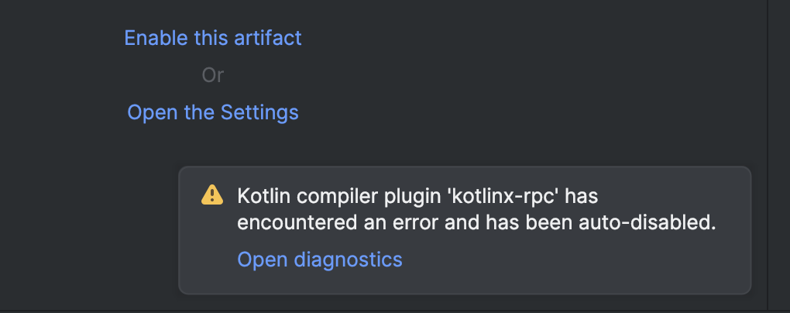
* **Exception Report (in Tool Window):** The diagnostics window provides a full report.
  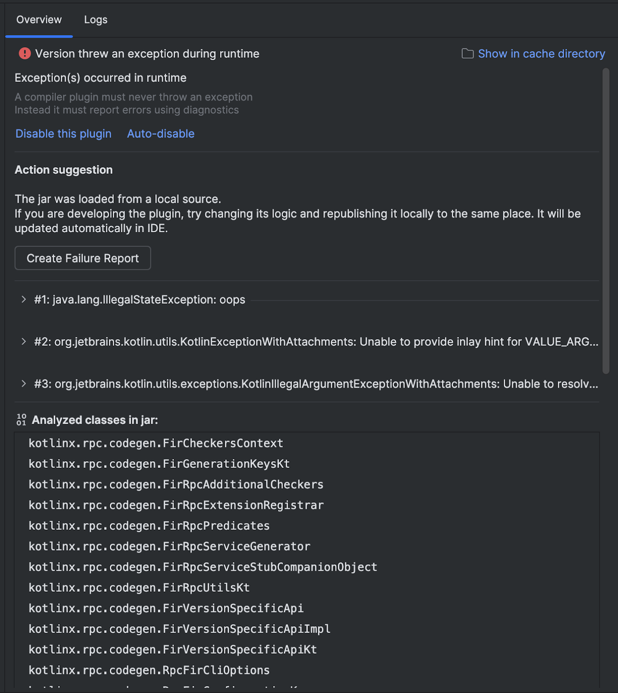
    * It shows the exception(s) that occurred.
    * It provides an "Action suggestion", such as creating a failure report.
    * It shows the analyzed classes from the jar.
    * It provides a **full, highlighted stack trace**, pointing to the exact class and line within the
      plugin that caused the failure.
      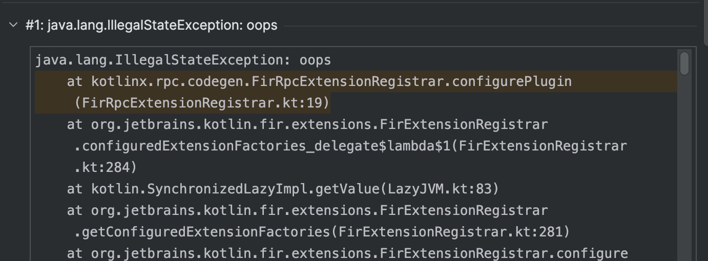
    * This exception information is preserved even after the plugin is disabled, allowing you to debug the
      issue.

---

## 4. Manual Actions

You can manually control KEFS using the <kbd>Find Action</kbd> (Ctrl/Cmd+Shift+A) menu.

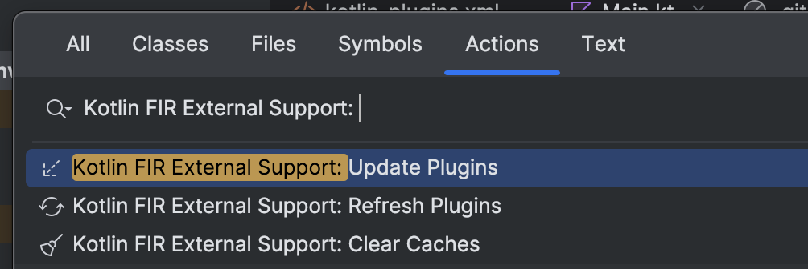

* **KEFS: Update Plugins:**
    * **What it does:** Immediately triggers the "Actualization" process for all plugins. This is
      useful if you just published a new version to a remote repository and want the IDE to pick it up without waiting
      for the 2-minute cycle.
* **KEFS: Refresh Plugins:**
    * **What it does:** Clears the entire in-memory state of all plugins and re-runs the entire resolution
      and indexing process from scratch. This is a heavier action, useful if the plugin's state seems
      corrupt. It does not affect the local disk cache and preserves detected exceptions.
* **KEFS: Clear Caches:**
    * **What it does:** Deletes all downloaded plugin jars from the local disk cache (
      `$USER_HOME/.kefs/<kotlin-ide-version>`) for the current IDE's Kotlin version.
      This will force KEFS to re-download
      all plugins.
* **KEFS: Copy Kotlin IDE Version:**
    * **What it does:** Copies the Kotlin compiler version used by your IDE to the clipboard and shows
      a confirmation notification. This is useful for plugin authors who need to know the exact Kotlin
      compiler version to compile against (see [Developer Guide](PLUGIN_AUTHORS.md)).

---

## 5. Advanced Use Case: Plugin "Hot-Reload" for Developers

KEFS is a powerful tool for *developing* compiler plugins. By combining **Local Repositories** and **File Watching**,
you can create a "hot-reload" workflow.

1. **In your compiler plugin project:** Set up your build script to publish your plugin artifacts to a local directory (e.g., `build/repo`).
2. **In KEFS Settings:**
    * Go to <kbd>Tools</kbd> > <kbd>Kotlin External FIR Support</kbd> > <kbd>Artifacts</kbd>.
    * Add a new **Maven Repository**.
    * Select `Local (File path)`.
    * Set the `Path` to your plugin's local output directory (e.g.,
      `/path/to/your-plugin/build/repo`).
    * Go to your **KEFS** settings and add a new plugin bundle.
    * Ensure your plugin bundle is configured with the correct coordinates and that it is linked to the new local
      repository you just added.
    * When done and saved the settings, `.idea/kotlin-plugins.xml` will be created in your project.
      Add it to your VCS so that other developers can use the same workflow.
3. **Run your build:** Publish your plugin to the local repo.
4. **Work in the IDE:** KEFS will find, load, and cache your local plugin
   (you may need to trigger "Update" manually in some cases).
5. **Make a change:** Go back to your compiler plugin code, make a change, and **re-publish** it to the local repo.
6. **See it update:** KEFS's file watchers will detect that the jar file in the local repository has
   changed. It will automatically invalidate the old version, load the new jar, and trigger
   an update in the Kotlin IDE plugin.

Your changes to the plugin will be reflected in the IDE's analysis and diagnostics almost immediately, without you
needing to restart the IDE.

See more details in the [Developer guide](PLUGIN_AUTHORS.md).

## 6. Advanced Use Case: Replacement patterns

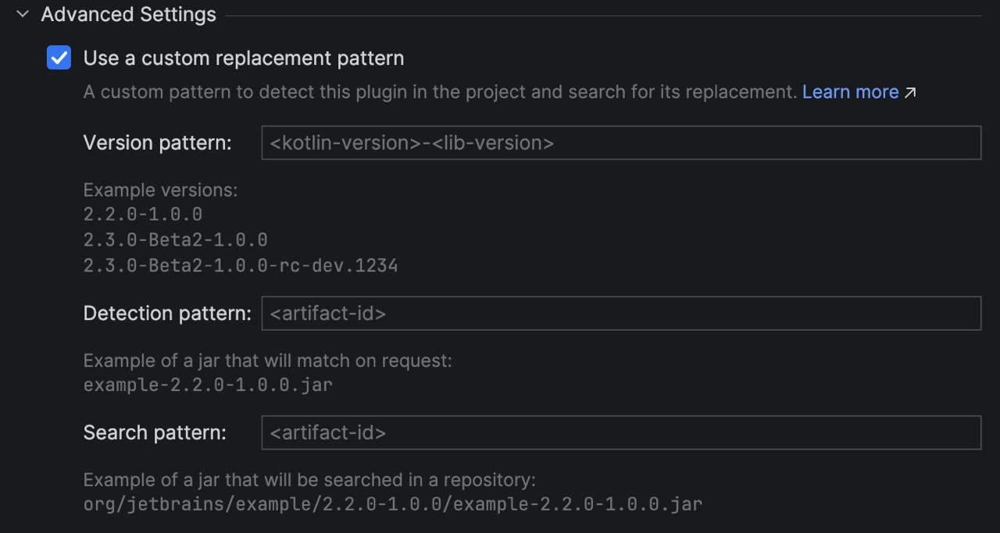

Replacement patterns allow changing how KEFS recognises jars.

For example, if your project uses artifacts with one name, but publishes them with another name
(Can be common during local development of the plugin). 
In this case you tell KEFS how to match the jar and how to search for it in repositories.

All patters have dedicated macros – templates that are used for matching.
Three replacement parameters are available:
 - **Version pattern** – how the version is parsed. Macros: `<kotlin-version>`, `<lib-version>`. 
   
   Default pattern: `<kotlin-version>-<lib-version>`
   
   Example: `2.2.0-1.0.0`
 - **Detect pattern** – how the artifact is detected when requested by IDE. Macros: `<artifact-id>`
   
   Default pattern: `<artifact-id>`
   
   Example: if an IDE requested a jar like `prefix-compiler-plugin-2.2.0-1.0.0.jar`
   then given the plugin's coordinates have `compiler-plugin` artifact id - it can be matched with the following pattern:
   `prefix-<artifact-id>` (with the version pattern from above, they are concatenated using a hyphen)
 - **Search pattern** – how the artifact is searched in repositories. Macros: `<artifact-id>`
   
   Default pattern: `<artifact-id>`
   
   Example: If KEFS searches for a jar with `org.jetbrains.kotlinx:compiler-plugin` maven id, there can be the following pattern:
   `prefix-<artifact-id>-postfix` (with the version pattern from above, they are concatenated using a hyphen).
   Then this will be the path used by the plugin in search:
   `REPO_ROOT/org/jetbrains/kotlinx/prefix-compiler-plugin-postfix/2.2.0-1.0.0/prefix-compiler-plugin-postfix-2.2.0-1.0.0.jar`

These examples in UI (except version pattern uses `+` as a demonstration):
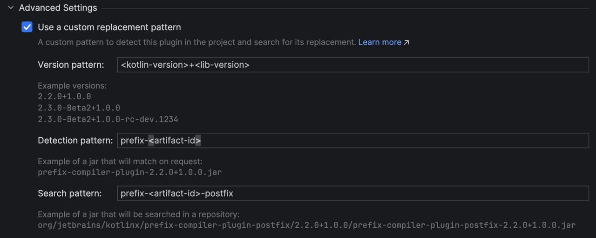

---

## 7. Troubleshooting

Sometimes things don't work as expected. This section covers common issues and how to resolve them.

### Plugin Appears Loaded but Doesn't Work

**Symptoms:**
- The KEFS Diagnostics Tool Window shows all plugins as successfully loaded (green status)
- However, plugin features don't work in the editor:
  - No custom highlighting or diagnostics from the plugin
  - No code generation rendering
  - IDE behaves as if the plugin isn't loaded

**Or you see a `ClassNotFoundException` error:**
```
java.lang.ClassNotFoundException: <ClassName of one of the plugins KEFS detected>
	at com.intellij.util.lang.UrlClassLoader.findClass(UrlClassLoader.java:259)
	at java.base/java.lang.ClassLoader.loadClass(ClassLoader.java:593)
	at java.base/java.lang.ClassLoader.loadClass(ClassLoader.java:526)
	at java.base/java.lang.Class.forName0(Native Method)
	at java.base/java.lang.Class.forName(Class.java:534)
	at java.base/java.lang.Class.forName(Class.java:513)
```

**Solutions (try in order):**

1. **Refresh Plugins**
   
   Use <kbd>Find Action</kbd> (Ctrl/Cmd+Shift+A) and run **"KEFS: Refresh Plugins"**.
   
   This clears the in-memory state and re-runs the entire resolution process. It's a lightweight action that doesn't affect your disk cache but can fix synchronization issues between KEFS and the IDE's Kotlin plugin.

2. **Clear Caches**
   
   If refreshing doesn't help, use <kbd>Find Action</kbd> and run **"KEFS: Clear Caches"**.
   
   This deletes all downloaded plugin jars from your local disk cache (`$USER_HOME/.kefs/<kotlin-ide-version>`), forcing KEFS to re-download and re-index all plugins from scratch. This can fix corrupted or incomplete downloads.

3. **Enable Extended Invalidation Delay**
   
   Use <kbd>Find Action</kbd> and run **"KEFS: Extended Invalidation Delay"**.
   
   This is an internal workaround for known issues on the IDE side.

### Still Having Issues?

If none of the above solutions work, or if the issue is annoying or reproducible, please [report an issue](https://github.com/Mr3zee/kotlin-plugins/issues) on our GitHub repository. When reporting, please include:

- Your IDE version and Kotlin plugin version (shown in <kbd>Tools</kbd> > <kbd>Kotlin External FIR Support</kbd> settings)
- The full error message or stack trace (if any)
- Screenshots of your KEFS Diagnostics Tool Window
- Steps to reproduce the issue

You can also use the built-in <kbd>Report to the 3rd Party</kbd> action when an exception occurs to send a detailed bug report directly to us.
